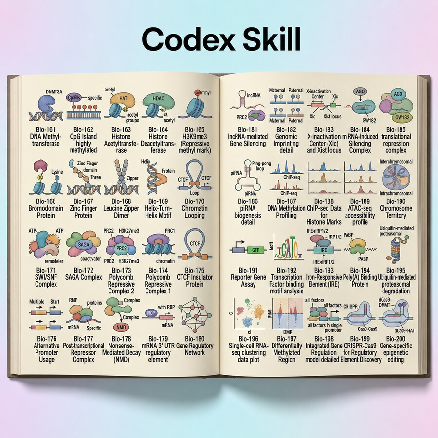
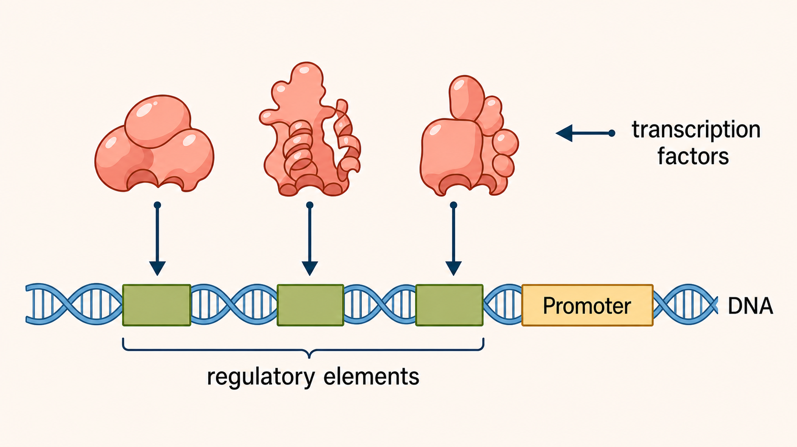
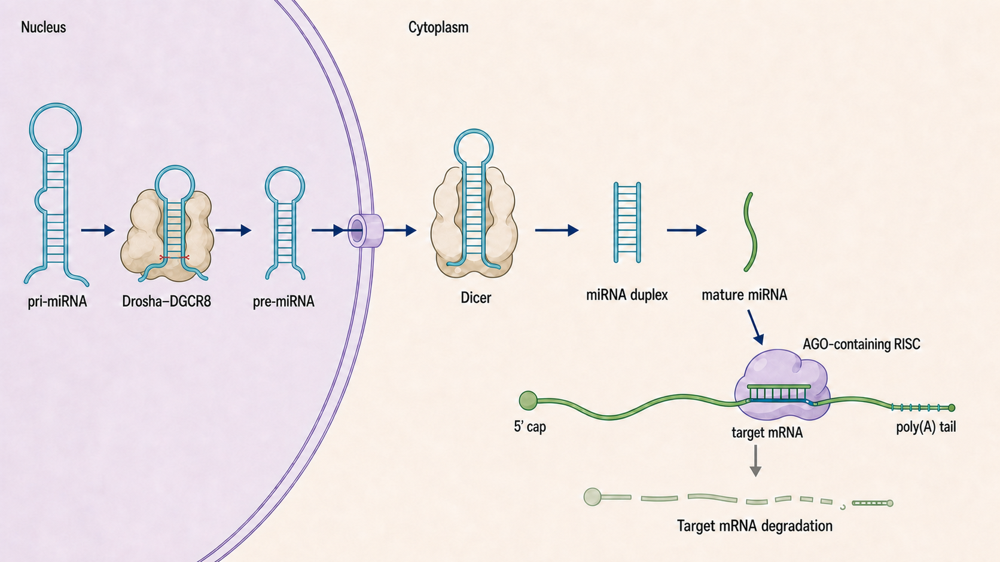

<p align="center">
  
</p>

# Textbook Figure Codex Skill

`book-figure` is a reusable Codex skill for redrawing or creating biology, molecular-biology, genomics, plant, viroid, RNA-silencing, chromatin, and regulatory schematics in one consistent editorial style.

Current version: **1.3.0**

## Install

Copy the `book-figure` folder into your Codex skills directory:

```bash
cp -R book-figure ~/.codex/skills/
```

Then invoke it in a request with `$book-figure`.

## Use

### Redraw and edit a supplied figure

```text
$book-figure redraw this figure, make the double strand dna as in the atlas
```

Original source figure:


Book Figure redraw with Atlas double-stranded DNA:



The source provides the panels, labels, entities, relationships, and reading order. By default, the result uses the visual atlas plus `genereg + detailed` rendering.

### Create a new figure from text

```text
$book-figure create canonical animal miRNA biogenesis—pri-miRNA → Drosha–DGCR8 → pore-exported pre-miRNA → Dicer → miRNA duplex → mature miRNA → one AGO-containing RISC bound to target mRNA → target mRNA degradation
```



Provide the intended entities, exact labels, relationships, and panel order. The skill builds the layout from the description.

## Modes

| Mode | When to use it | Result |
| --- | --- | --- |
| visual atlas | Default | Selects exact biological forms and complexes from five indexed reference panels and supplies an object-only montage to ImageGen. |
| `genereg` | Default | Uses the bundled global reference for warm ivory paper, editorial hierarchy, and layout language. |
| `detailed` | Default | Adds scientifically precise 2D conventions for RNA/DNA, proteins, genes, motifs, modules, and compartments without 3D or cartoon rendering. |
| `ref` | When the source must provide facts only | Extracts scientific content without passing the source to ImageGen; only the atlas montage and global reference are used. |
| `atlas-debug` | Before spending an ImageGen request | Reports exact/composite/fallback selection and builds the reference montage without generating a figure. |
| `standard` | Only on explicit request | Generates without the bundled `genereg` reference. |
| `simplified` | Only on explicit request | Uses a less structurally detailed schematic treatment. |

Modes can be requested in plain language, for example: `use ref mode` or `without detailed`.

## Typography

- Use **Inter** for headings, labels, annotations, panel letters, and English or Bulgarian text.
- Use **Roboto Mono** only for displayed nucleotide sequences and sequence-only motifs, including their nucleotide letters, hyphens, and 5′/3′ markers.
- Render **all visible text in pure black `#000000`** in both typefaces, including labels inside colored biological objects. Slate blue remains reserved for outlines, arrows, and connectors.

## Included asset

`book-figure/assets/genereg-reference.png` is the bundled style-only reference. Keep it with the skill when copying, packaging, or installing it.

## Visual biological-object atlas

Version 1.3.0 adds five immutable indexed panels with 136 biological-form references. Stable semantic IDs and aliases replace the duplicated printed `Bio-###` identifiers. ImageGen receives only a bounded montage of relevant object crops, never the original panel grid or captions.

```bash
ruby book-figure/scripts/atlas_debug.rb \
  --root book-figure/atlas \
  --entities "pri-miRNA,Dicer,AGO-containing RISC,target mRNA,DNA helicase" \
  --output-dir /absolute/output/path
```

The diagnostic command writes `atlas-selection-report.yml` and `atlas-reference-montage.png` without calling ImageGen. Missing objects use same-category and molecular-contact exemplars.

## Design system and maintenance

- `book-figure/references/design-tokens.md` defines the authoritative geometry and typography.
- `book-figure/references/semantic-colors.md` defines stable biological-role color assignments.
- `book-figure/references/object-atlas.md` defines reference selection, montage, fallback, and upgrades.
- `book-figure/atlas/manifest.yml` registers the immutable panels and panel indexes.
- `book-figure/tests/contract-cases.yml` contains representative consistency cases.
- `book-figure/scripts/validate_skill.rb` checks package integrity without external dependencies.
- `book-figure/VERSION` follows semantic versioning.
- `CHANGELOG.md` records user-visible releases.

Validate the package before publishing:

```bash
ruby book-figure/scripts/validate_skill.rb
```

When changing a design token or semantic role, update the relevant reference, bump `VERSION`, add a changelog entry, run the validator, and forward-test at least one contract case.

## Author

**Prof. Vesselin Baev**  
Dept. Molecular Biology, Faculty of Biology  
Paisii Hilendarski University of Plovdiv, Bulgaria 
https://vebaev.github.io/CV/

## Citation

If you use Book Figure, please cite:

> Baev, V. (2026). *vebaev/book-figure-skill: Codex Skill for Molecular Biology Textbook Figures* (Version 1.3.0). Zenodo. https://doi.org/10.5281/zenodo.21669810

Author ORCID: [0000-0002-5224-9145](https://orcid.org/0000-0002-5224-9145)

## License

Distributed under the [MIT License](LICENSE).
